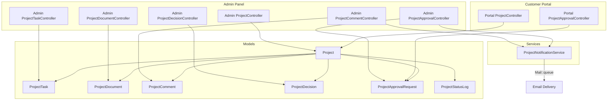
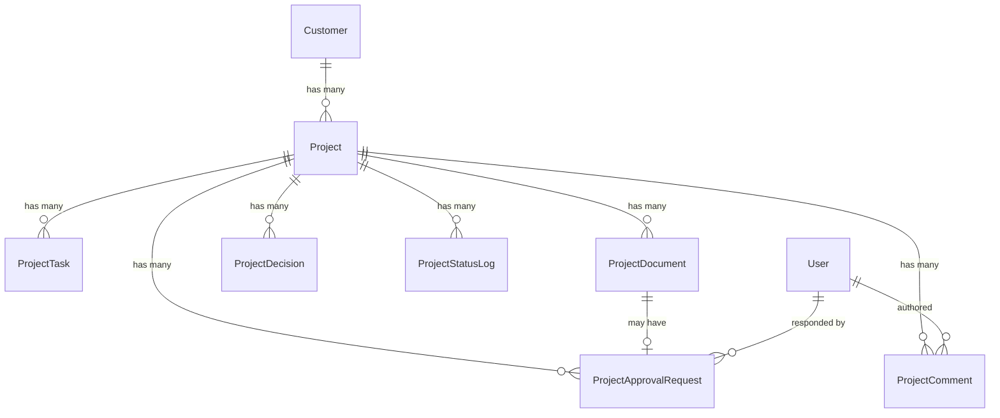

# Design Document: Customer Projects

## Overview

The Customer Projects feature adds project management capabilities to the CRM, enabling admins to track website builds and similar deliverables per customer. It introduces a project lifecycle with tasks, comments (internal/public), document management with approval workflows, and a customer-facing portal view.

The feature integrates into the existing architecture:
- **Admin panel** (`/admin/projects`) for full project management
- **Customer portal** (`/portal/projects`) for read-only progress tracking, document access, and approval actions
- **Email notifications** for customer communication on public updates and approval requests

### Key Design Decisions

1. **Single `projects` table with `company_id` FK** — follows the existing pattern used by Tickets, Services, and Domains
2. **Status history stored in a separate `project_status_logs` table** — provides an audit trail without cluttering the main table
3. **Polymorphic approval requests** — a single `project_approval_requests` table handles both document approvals and project completion approvals via a `type` column
4. **Queue-based notifications** — emails dispatched via Laravel's queue system using `Mail::queue()` to meet the "within 5 minutes" SLA without blocking requests
5. **File storage via Laravel's `Storage` facade** — documents stored on the configured disk (local/S3) under `project-documents/{project_id}/`
6. **`previous_status` column on projects** — captures the pre-Awaiting Approval status so rejection can cleanly revert

## Architecture



## Components and Interfaces

### Controllers

#### Admin Controllers (under `App\Http\Controllers\Admin`)

| Controller | Routes | Responsibility |
|---|---|---|
| `ProjectController` | CRUD on `/admin/projects` | Create, list, show, edit, update, delete projects; reopen action |
| `ProjectTaskController` | Nested under projects | CRUD tasks within a project; reorder |
| `ProjectDocumentController` | Nested under projects | Upload, delete documents |
| `ProjectCommentController` | Nested under projects | Add comments (internal/public) |
| `ProjectDecisionController` | Nested under projects | CRUD decisions |
| `ProjectApprovalController` | Nested under projects | Request document/completion approvals |

#### Portal Controllers (under `App\Http\Controllers\Portal`)

| Controller | Routes | Responsibility |
|---|---|---|
| `ProjectController` | `/portal/projects` | List active projects, show project detail |
| `ProjectApprovalController` | `/portal/projects/{project}/approvals` | Approve/reject approval requests |

### Route Definitions

```php
// Admin routes (within existing admin group)
Route::resource('projects', Admin\ProjectController::class);
Route::post('/projects/{project}/reopen', [Admin\ProjectController::class, 'reopen'])->name('projects.reopen');

Route::prefix('projects/{project}')->name('projects.')->group(function () {
    Route::resource('tasks', Admin\ProjectTaskController::class)->except(['show']);
    Route::post('tasks/reorder', [Admin\ProjectTaskController::class, 'reorder'])->name('tasks.reorder');
    Route::resource('documents', Admin\ProjectDocumentController::class)->only(['store', 'destroy']);
    Route::post('comments', [Admin\ProjectCommentController::class, 'store'])->name('comments.store');
    Route::resource('decisions', Admin\ProjectDecisionController::class)->except(['show']);
    Route::post('approvals/document/{document}', [Admin\ProjectApprovalController::class, 'requestDocumentApproval'])->name('approvals.document');
    Route::post('approvals/completion', [Admin\ProjectApprovalController::class, 'requestCompletionApproval'])->name('approvals.completion');
});

// Portal routes (within existing portal group)
Route::get('/projects', [Portal\ProjectController::class, 'index'])->name('projects.index');
Route::get('/projects/{project}', [Portal\ProjectController::class, 'show'])->name('projects.show');
Route::get('/projects/{project}/documents/{document}/download', [Portal\ProjectController::class, 'downloadDocument'])->name('projects.documents.download');
Route::post('/projects/{project}/approvals/{approval}/approve', [Portal\ProjectApprovalController::class, 'approve'])->name('projects.approvals.approve');
Route::post('/projects/{project}/approvals/{approval}/reject', [Portal\ProjectApprovalController::class, 'reject'])->name('projects.approvals.reject');
```

### Service Classes

#### `App\Services\ProjectNotificationService`

Responsible for all project-related email notifications. Encapsulates recipient resolution and email dispatch.

```php
class ProjectNotificationService
{
    public function notifyPublicComment(Project $project, ProjectComment $comment): void;
    public function notifyApprovalRequest(Project $project, ProjectApprovalRequest $approval): void;
    public function notifyCompletionRejection(Project $project, ProjectApprovalRequest $approval): void;
    public function getNotificationSummary(string $text, int $maxLength = 200): string;
}
```

### Form Requests

| Request Class | Used By | Validates |
|---|---|---|
| `StoreProjectRequest` | Admin ProjectController@store | title (required, max:255), description (max:5000), company_id (required, exists) |
| `UpdateProjectRequest` | Admin ProjectController@update | title (required, max:255), description (max:5000), status (in valid list) |
| `StoreProjectTaskRequest` | Admin ProjectTaskController@store | title (required, max:255), description (max:2000), display_order (integer) |
| `UpdateProjectTaskRequest` | Admin ProjectTaskController@update | title (max:255), description (max:2000), status (in list), display_order (integer) |
| `StoreProjectDocumentRequest` | Admin ProjectDocumentController@store | file (required, max:20480, mimes), label (required, max:255), document_type (in list) |
| `StoreProjectCommentRequest` | Admin ProjectCommentController@store | body (required, max:5000), is_internal (boolean) |
| `StoreProjectDecisionRequest` | Admin ProjectDecisionController@store | title (required, max:255), description (max:2000), category (nullable, in list) |
| `RejectApprovalRequest` | Portal ProjectApprovalController@reject | reason (nullable/required depending on type, max:1000) |

## Data Models

### Entity Relationship Diagram



### Database Schema

#### `projects` table

| Column | Type | Constraints |
|---|---|---|
| id | bigint unsigned | PK, auto-increment |
| company_id | bigint unsigned | FK → customers.company_id, NOT NULL |
| title | varchar(255) | NOT NULL |
| description | text, nullable | max 5000 enforced at application level |
| status | varchar(50) | NOT NULL, default "Not Started" |
| previous_status | varchar(50), nullable | Stores status before "Awaiting Approval" |
| created_at | timestamp | |
| updated_at | timestamp | |

#### `project_tasks` table

| Column | Type | Constraints |
|---|---|---|
| id | bigint unsigned | PK, auto-increment |
| project_id | bigint unsigned | FK → projects.id, NOT NULL, CASCADE |
| title | varchar(255) | NOT NULL |
| description | text, nullable | max 2000 at app level |
| status | varchar(50) | NOT NULL, default "To Do" |
| display_order | integer unsigned | NOT NULL, default 0 |
| created_at | timestamp | |
| updated_at | timestamp | |

#### `project_documents` table

| Column | Type | Constraints |
|---|---|---|
| id | bigint unsigned | PK, auto-increment |
| project_id | bigint unsigned | FK → projects.id, NOT NULL, CASCADE |
| label | varchar(255) | NOT NULL |
| document_type | varchar(50) | NOT NULL (Agreement, Contract, Quote, Design Asset, Other) |
| file_path | varchar(500) | NOT NULL |
| original_filename | varchar(255) | NOT NULL |
| file_size | bigint unsigned | NOT NULL (bytes) |
| uploaded_by | bigint unsigned | FK → users.id, NOT NULL |
| created_at | timestamp | |
| updated_at | timestamp | |

#### `project_comments` table

| Column | Type | Constraints |
|---|---|---|
| id | bigint unsigned | PK, auto-increment |
| project_id | bigint unsigned | FK → projects.id, NOT NULL, CASCADE |
| user_id | bigint unsigned | FK → users.id, NOT NULL |
| body | text | NOT NULL (1-5000 chars at app level) |
| is_internal | boolean | NOT NULL, default false |
| created_at | timestamp | |
| updated_at | timestamp | |

#### `project_decisions` table

| Column | Type | Constraints |
|---|---|---|
| id | bigint unsigned | PK, auto-increment |
| project_id | bigint unsigned | FK → projects.id, NOT NULL, CASCADE |
| title | varchar(255) | NOT NULL |
| description | text, nullable | max 2000 at app level |
| category | varchar(50), nullable | Design Requirement, Client Decision, Technical Decision |
| date_recorded | date | NOT NULL, defaults to today |
| created_at | timestamp | |
| updated_at | timestamp | |

#### `project_approval_requests` table

| Column | Type | Constraints |
|---|---|---|
| id | bigint unsigned | PK, auto-increment |
| project_id | bigint unsigned | FK → projects.id, NOT NULL, CASCADE |
| project_document_id | bigint unsigned, nullable | FK → project_documents.id, SET NULL |
| type | varchar(50) | NOT NULL (Document Approval, Project Completion) |
| status | varchar(50) | NOT NULL, default "Pending" |
| responded_by | bigint unsigned, nullable | FK → users.id |
| responded_at | timestamp, nullable | |
| rejection_reason | text, nullable | max 1000 at app level |
| created_at | timestamp | |
| updated_at | timestamp | |

#### `project_status_logs` table

| Column | Type | Constraints |
|---|---|---|
| id | bigint unsigned | PK, auto-increment |
| project_id | bigint unsigned | FK → projects.id, NOT NULL, CASCADE |
| status | varchar(50) | NOT NULL |
| changed_by | bigint unsigned | FK → users.id, NOT NULL |
| created_at | timestamp | |

### Eloquent Models

#### `Project`

```php
class Project extends Model
{
    protected $fillable = [
        'company_id', 'title', 'description', 'status', 'previous_status',
    ];

    const STATUSES = ['Not Started', 'In Progress', 'On Hold', 'Awaiting Approval', 'Completed'];

    public function customer(): BelongsTo;
    public function tasks(): HasMany;
    public function documents(): HasMany;
    public function comments(): HasMany;
    public function decisions(): HasMany;
    public function approvalRequests(): HasMany;
    public function statusLogs(): HasMany;

    public function getProgressPercentageAttribute(): int
    {
        $total = $this->tasks()->count();
        if ($total === 0) return 0;
        $done = $this->tasks()->where('status', 'Done')->count();
        return (int) floor(($done / $total) * 100);
    }
}
```

#### `ProjectTask`

```php
class ProjectTask extends Model
{
    protected $fillable = ['project_id', 'title', 'description', 'status', 'display_order'];
    const STATUSES = ['To Do', 'In Progress', 'Done'];

    public function project(): BelongsTo;
}
```

#### `ProjectDocument`

```php
class ProjectDocument extends Model
{
    protected $fillable = ['project_id', 'label', 'document_type', 'file_path', 'original_filename', 'file_size', 'uploaded_by'];
    const TYPES = ['Agreement', 'Contract', 'Quote', 'Design Asset', 'Other'];
    const ALLOWED_EXTENSIONS = ['pdf', 'docx', 'xlsx', 'png', 'jpg', 'zip'];
    const MAX_SIZE_MB = 20;

    public function project(): BelongsTo;
    public function uploader(): BelongsTo; // users table
    public function approvalRequest(): HasOne;
}
```

#### `ProjectComment`

```php
class ProjectComment extends Model
{
    protected $fillable = ['project_id', 'user_id', 'body', 'is_internal'];
    protected $casts = ['is_internal' => 'boolean'];

    public function project(): BelongsTo;
    public function user(): BelongsTo;
}
```

#### `ProjectDecision`

```php
class ProjectDecision extends Model
{
    protected $fillable = ['project_id', 'title', 'description', 'category', 'date_recorded'];
    protected $casts = ['date_recorded' => 'date'];
    const CATEGORIES = ['Design Requirement', 'Client Decision', 'Technical Decision'];

    public function project(): BelongsTo;
}
```

#### `ProjectApprovalRequest`

```php
class ProjectApprovalRequest extends Model
{
    protected $fillable = ['project_id', 'project_document_id', 'type', 'status', 'responded_by', 'responded_at', 'rejection_reason'];
    protected $casts = ['responded_at' => 'datetime'];
    const TYPES = ['Document Approval', 'Project Completion'];
    const STATUSES = ['Pending', 'Approved', 'Rejected'];

    public function project(): BelongsTo;
    public function document(): BelongsTo; // nullable
    public function respondedBy(): BelongsTo; // users table
}
```

#### `ProjectStatusLog`

```php
class ProjectStatusLog extends Model
{
    public $timestamps = false;
    protected $fillable = ['project_id', 'status', 'changed_by', 'created_at'];
    protected $casts = ['created_at' => 'datetime'];

    public function project(): BelongsTo;
    public function changedBy(): BelongsTo;
}
```

### Model Additions to Existing Models

**Customer model** — add relationship:
```php
public function projects(): HasMany
{
    return $this->hasMany(Project::class, 'company_id', 'company_id');
}
```

## Correctness Properties

*A property is a characteristic or behavior that should hold true across all valid executions of a system — essentially, a formal statement about what the system should do. Properties serve as the bridge between human-readable specifications and machine-verifiable correctness guarantees.*

### Property 1: Project list ordering

*For any* set of projects in the system, the admin project list SHALL return them ordered by `created_at` descending (most recently created first).

**Validates: Requirements 1.4**

### Property 2: Status change creates history log

*For any* valid status transition on a project, the system SHALL create a `ProjectStatusLog` entry recording the new status, the acting user, and the current timestamp.

**Validates: Requirements 2.2**

### Property 3: Completed status blocks transitions

*For any* project with status "Completed" and any target status, attempting a direct status change (without using the reopen action) SHALL be rejected.

**Validates: Requirements 2.3, 2.4**

### Property 4: Task progress calculation

*For any* project with N tasks where D tasks have status "Done", the progress percentage SHALL equal `floor(D / N * 100)` when N > 0, and 0 when N = 0.

**Validates: Requirements 3.4, 3.6**

### Property 5: Task ordering by display order

*For any* set of tasks within a project, retrieving tasks for display SHALL return them ordered by `display_order` ascending.

**Validates: Requirements 3.3**

### Property 6: Document upload file validation

*For any* uploaded file, the system SHALL accept it if and only if its extension is in [pdf, docx, xlsx, png, jpg, zip] AND its size is ≤ 20 MB.

**Validates: Requirements 4.1, 4.4**

### Property 7: Customer comment visibility filtering

*For any* project with a mix of internal and public comments, a customer query SHALL return only public comments, ordered by `created_at` ascending (oldest first).

**Validates: Requirements 5.2, 5.3**

### Property 8: Admin comment visibility

*For any* project, an admin query SHALL return all comments (both internal and public) ordered by `created_at` ascending (oldest first).

**Validates: Requirements 5.5**

### Property 9: Notification summary truncation

*For any* text string used as notification content, the generated summary SHALL contain at most 200 characters.

**Validates: Requirements 6.3**

### Property 10: Approval request terminal state immutability

*For any* approval request with status "Approved" or "Rejected", any attempt to change its status SHALL be rejected.

**Validates: Requirements 7.5**

### Property 11: No duplicate pending approval per document

*For any* document that already has an approval request with status "Pending", attempting to create another approval request for that document SHALL be rejected.

**Validates: Requirements 7.6**

### Property 12: No duplicate pending completion approval

*For any* project that already has a pending "Project Completion" approval request, attempting to create another completion approval SHALL be rejected.

**Validates: Requirements 8.2**

### Property 13: Completion rejection reverts status

*For any* project in "Awaiting Approval" status, when the customer rejects the completion approval, the project status SHALL revert to the value stored in `previous_status`.

**Validates: Requirements 8.4**

### Property 14: Decisions ordered by date descending

*For any* set of decisions within a project, retrieving decisions SHALL return them ordered by `date_recorded` descending (newest first).

**Validates: Requirements 9.2**

### Property 15: Customer portal project filtering

*For any* customer, the portal project list SHALL return only projects belonging to their company with a status other than "Completed", ordered by `updated_at` descending.

**Validates: Requirements 10.1**

### Property 16: Customer company-scoped access control

*For any* customer user and any project that does not belong to their company, attempting to access that project SHALL return a 404 not-found response.

**Validates: Requirements 10.4, 10.5**

## Error Handling

### Validation Errors

All form submissions use Laravel Form Request classes that return validation errors as standard Laravel error bags, displayed via Blade `@error` directives. Key validations:

- **Project creation**: Missing title or customer → 422 with field-specific messages
- **Task creation**: Missing title → 422 with message
- **Document upload**: Invalid type → "File must be PDF, DOCX, XLSX, PNG, JPG, or ZIP"; size exceeded → "File must be 20 MB or less"
- **Comment**: Empty body → "Comment body is required"
- **Decision**: Missing title → "Decision title is required"
- **Approval rejection reason**: For completion rejections, reason is required (1-1000 chars)

### Business Logic Errors

- **Status change on completed project** → redirect back with flash error: "This project is completed. Please reopen it first."
- **Duplicate pending approval** → redirect back with flash error: "An approval request is already pending for this document."
- **Duplicate completion approval** → redirect back with flash error: "A completion approval is already pending."
- **Approval response on non-pending request** → redirect back with flash error: "This approval request has already been resolved."

### Notification Failures

- Email dispatch failures are caught in the `ProjectNotificationService`
- Failures are logged via `Log::error()` with context (project ID, recipients, exception message)
- A flash message is shown to the admin: "Customer notification could not be sent. Check logs for details."
- The primary action (comment creation, approval request) still succeeds — notification failure does not roll back the action

### File Storage Errors

- Storage write failures are caught during upload
- The upload is rejected with a generic error: "File upload failed. Please try again."
- Existing documents remain unchanged (atomic operation — document record only created after successful file storage)

### Authorization Errors

- Customer accessing another company's project → 404 (not 403, to avoid information leakage)
- Non-admin accessing admin routes → 403 via `EnsureIsAdmin` middleware (existing behavior)

## Testing Strategy

### Unit Tests (Example-Based)

Focus on specific scenarios and edge cases:

- Project creation with valid/invalid data
- Status transitions (valid and invalid combinations)
- Document upload with boundary file sizes (exactly 20 MB, 20 MB + 1 byte)
- Approval workflow state machine (pending → approved, pending → rejected, duplicate prevention)
- Completion approval lifecycle (request → approve → completed status; request → reject → revert)
- Authorization checks (customer accessing own vs other company's project)

### Property-Based Tests

Use [Pest](https://pestphp.com/) with a property-testing plugin or PHPUnit with `phpunit/phpunit` and a data provider generating random inputs. Minimum 100 iterations per property.

Each property test references its design document property:

```php
// Feature: customer-projects, Property 4: Task progress calculation
test('progress percentage equals floor of done/total * 100', function () {
    // Generate random task sets with random statuses
    // Verify formula: floor(done_count / total_count * 100)
});
```

**Properties to implement as PBT:**
- Property 4 (progress calculation) — pure math, ideal for PBT
- Property 7 (comment visibility filtering) — filtering logic with random mixes
- Property 9 (notification summary truncation) — string truncation with random inputs
- Property 15 (portal project filtering) — filtering + ordering with random data

**Properties better suited to example-based tests:**
- Properties 3, 10, 11, 12 (state machine constraints) — limited state space
- Properties 1, 5, 8, 14 (ordering) — can be verified with small data sets
- Property 16 (authorization) — integration-level test

### Integration Tests

- Full request lifecycle: create project → add tasks → upload docs → add comments → request approval → customer approves
- Email notification dispatch verification using `Mail::fake()`
- File upload and download with actual storage (using `Storage::fake()`)
- Portal access control with authenticated customer users

### Test Configuration

```php
// Property test tag format
// Feature: customer-projects, Property {number}: {property_text}
// Minimum 100 iterations for property-based tests
```
